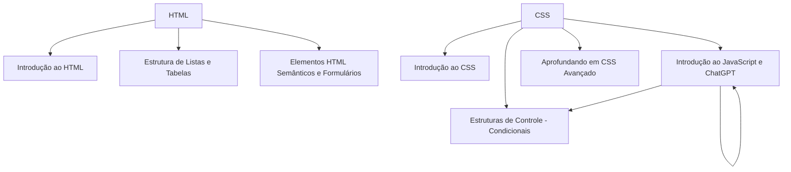

# Curso de Desenvolvimento Fullstacker

## Sobre
O curso tem como objetivo preparar o estudante para lidar com as tecnologias do mercado de frontende e backend. Para o forntend o estudante aprende: HTLM, CSS, Javascript
E para o backend é usado o: Phyton.

Grade currícular

